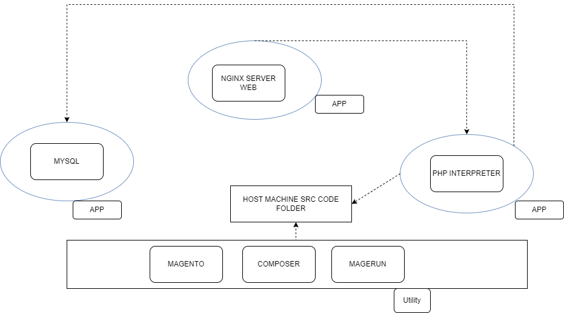

# Dockerfiles
- **composer.dockerfile**: Utility for run composer command
- **magento.dockerfile**: Utility for run magento command
- **magerun.dockerfile**: Utility for run magento cli command
- **nginx.dockerfile**: Dockerfile for start and configure nginx
- **php.dockerfile**: Dockerfile for php interpreter

# Process of setup
- Generate magento project using composer utility
- Start database using docker composer
- Setup and install magento using magento utility
